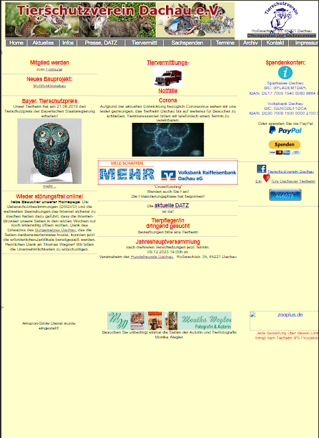
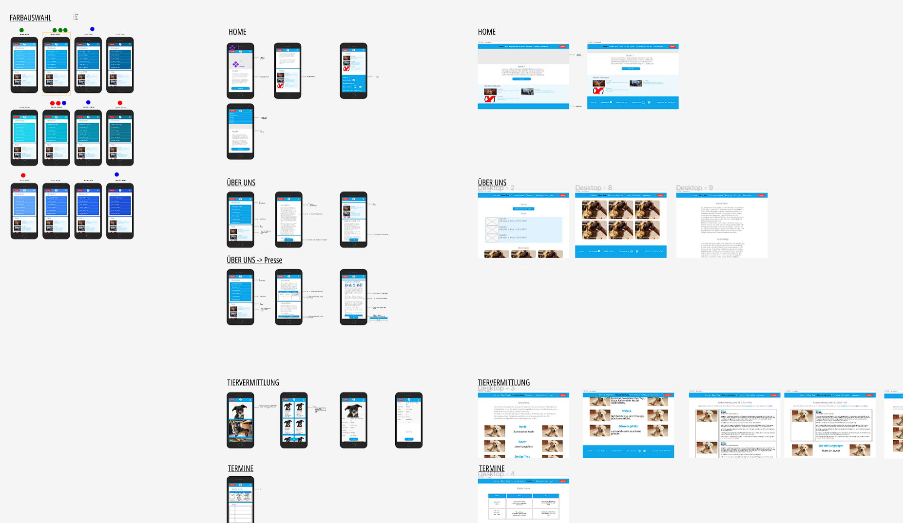

# DCI finales Teamprojekt - Tierschutzvereins Dachau e.V

## Inhaltsverzeichnis

- [Projektbeschreibung](#projektbeschreibung)
  <!-- - [Installation](#installation) -->
  <!-- - [Verwendung](#verwendung) -->
  - [Technologien](#technologien)
  - [Beitragende](#beitragende)

## Projektbeschreibung

Als Thematik des finalen Teamprojekts unserer einjährigen DCI-Umschulung zu Fullstack Developern (MERN-Stack) haben wir uns dazu entschieden, die bestehende Internetpräsenz des Tierschutzvereins Dachau e.V, `https://www.tierschutz.dachau.net/`, zu überarbeiten.

Nach Einrichtung der Arbeitsumgebung erfolgte die Planung und Erstellung eines Gantt Chart Projektplanes, welcher die verschiedenen Phasen des Projektes abbildete, darunter vor allem die folgenden wesentlichen Blöcke:

1. Scope & Goal Setting
2. Set up Workflow
3. FRONTEND: Layout & Mockup
4. FRONTEND: Component Planning
5. FRONTEND: Build
6. FRONTEND: Testing
7. BACKEND: Endpoint Planning
8. BACKEND: Build
9. BACKEND: Testing
10. BACKEND & FRONTEND: Combining
11. Presentation

Die Erstellung der Designs erfolgte in Figma. Der Fokus lag zunächst auf dem bekannte "Mobile-first"-Ansatz. Basierend darauf wurden die Designs für die Ansichten von Pads, Laptop und Desktop via der in Tailwind CSS verfügbaren Mediaqueries erweitern.

Alle Teammitglieder arbeiteten zunächst an der Erstellung des Frontend. Die Aufteilung der Tasks erfolgte via des in Github integrierten Projektboards. Nach der Erstellung der "Mobile-first"-Ansicht fing die Hälfte des Teams mit der Erstellung des Backend an, während die andere Hälfte via Tailwind CSS Mediaqueries die Desktop Ansicht erstellte.

Je zum Ende der Frontend- und Backend-Phase wurde eine intensievere Testphase veranschlagt.

Zuletzt erfolgte die Verbindung des Front- mit dem Backend sowie die Erstellung der ABschlusspräsentation.

<!-- ## Installation

1. Klonen Sie das Repository: `git clone <repository-url>`
2. Wechseln Sie in das Projektverzeichnis: `cd <project-directory>`
3. Installieren Sie die Abhängigkeiten: `npm install` -->

<!-- ## Verwendung

1. Starten Sie die Entwicklungsserver: `npm start`
2. Öffnen Sie Ihren Browser und navigieren Sie zu `http://localhost:3000` -->

## Technologien

- React
- Node.js
- Express
- MongoDB
- Tailwind CSS

## Beitragende

- [Ksenia (Backend Lead)](https://github.com/KseniaBr)
- [Hendri (Frontend Lead)](https://github.com/enozen)
- [Ahmad (Workflow Lead)](https://github.com/AhmadHoush)
- [David (Project Lead)](https://github.com/MrburnsDAOC)
