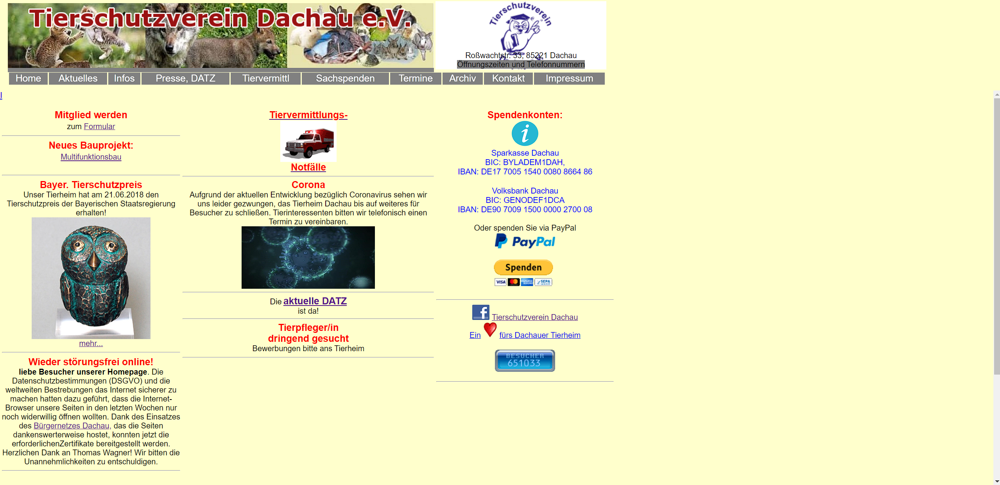
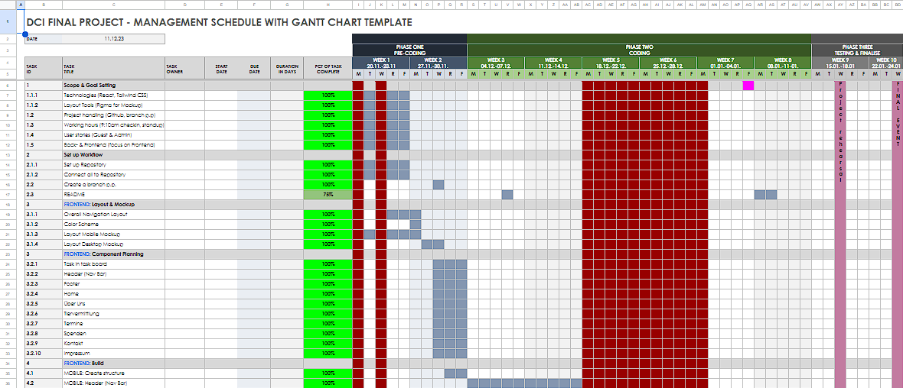
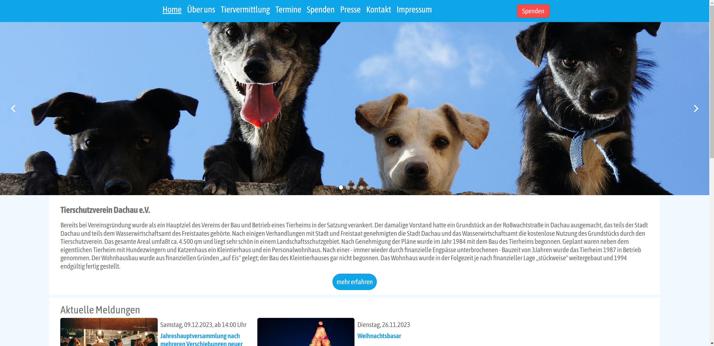
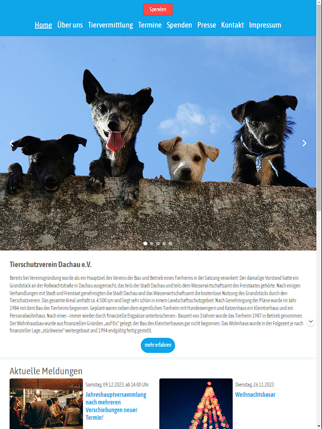
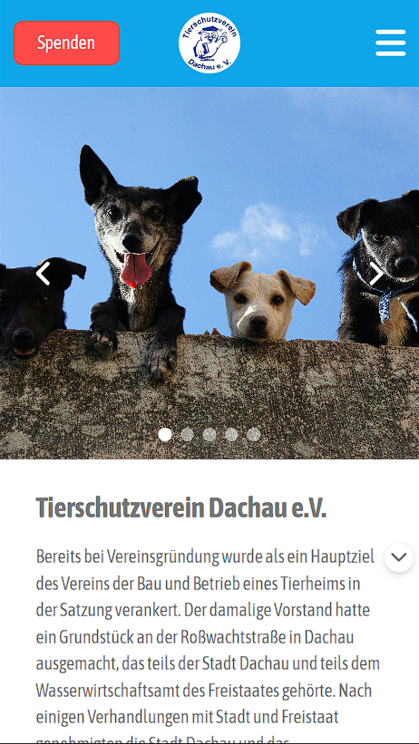

# DCI finales Teamprojekt - Tierschutzverein Dachau e.V

Link: [unsere Webseite](https://tierheim-dachau.onrender.com/)

## Inhaltsverzeichnis

- [Projektbeschreibung](#projektbeschreibung)
- [Workflow](#workflow)
- [Design](#design)
- [Frontend](#frontend)
- [Backend](#backend)
- [Technologien](#technologien)
- [Beitragende](#beitragende)

## Projektbeschreibung

Als Thematik des finalen Teamprojekts unserer einjährigen DCI-Umschulung zu Fullstack Developern (MERN-Stack) haben wir uns dazu entschieden, die bestehende Internetpräsenz des Tierschutzvereins Dachau e.V, `https://www.tierschutz.dachau.net/`, zu überarbeiten.

[🔼 Back to top](#inhaltsverzeichnis)

### Workflow
Nach Einrichtung der Arbeitsumgebung erfolgte die Planung und Erstellung eines Gantt Chart Projektplanes, welcher die verschiedenen Phasen des Projektes abbildete, darunter vor allem die folgenden wesentlichen Blöcke:

1. Scope & Goal Setting
2. Set up Workflow
3. FRONTEND: Layout & Mockup
4. FRONTEND: Component Planning
5. FRONTEND: Build
6. FRONTEND: Testing
7. BACKEND: Endpoint Planning
8. BACKEND: Build
9. BACKEND: Testing
10. BACKEND & FRONTEND: Combining
11. Presentation

Hier ein Auszug aus dem Gantt  Projektplan:

[🔼 Back to top](#inhaltsverzeichnis)

### Design

Die Erstellung der Designs erfolgte in Figma. Der Fokus lag zunächst auf dem bekannte "Mobile-first"-Ansatz. Basierend darauf wurden die Designs für die Ansichten von Pads, Laptop und Desktop via der in Tailwind CSS verfügbaren Mediaqueries erweitern.

[🔼 Back to top](#inhaltsverzeichnis)

### Frontend
Alle Teammitglieder arbeiteten zunächst an der Erstellung des Frontend. Die Aufteilung der Tasks erfolgte via des in Github integrierten Projektboards. Nach der Erstellung der "Mobile-first"-Ansicht fing die Hälfte des Teams mit der Erstellung des Backend an, während die andere Hälfte via Tailwind CSS Mediaqueries die Desktop Ansicht erstellte. Hier die beispielhaften Ansichten der Homepage auf mobile, tablet und desktop:

#### Desktop

#### Tablet
 

#### Mobile

[🔼 Back to top](#inhaltsverzeichnis)

### Backend
Im Backend galt es zunächste, sich für eine Technologie zu entscheiden. Schnell stand fest, dass wir eine CMS-Lösung der von MongoDB vorziehen, um die einfachere Bedienung und Einstellung von Inhalten durch das Personal des Tierheims zu ermöglichen. Die Wahl fiel schließlich auf das CMS von [kontent.ai](https://kontent.ai/) welches alle für das Projekt nötigen Umfänge in der kostenlosen Version zur Verfügung stellt. Die für Änderungen relevantesten Inhalte wurden definiert und jeweils in einer Collection angelegt. Daraus ergaben sich zunächst die folgenden Content Model, welche bei kontent.ai als Vordefinierter Datensatz fungieren:

- Termine
- Pressestimmen
- Sonstige Medienberichte
- DATZ
- Tiere

[🔼 Back to top](#inhaltsverzeichnis)

## Technologien

- React
- JavaScript
- Node.js
- Tailwind CSS
- CMS kontent.ai

[🔼 Back to top](#inhaltsverzeichnis)

## Beitragende

- [Ksenia (Backend Lead)](https://github.com/KseniaBr)
- [Hendri (Frontend Lead)](https://github.com/enozen)
- [Ahmad (Workflow Lead)](https://github.com/AhmadHoush)
- [David (Project Lead)](https://github.com/MrburnsDAOC)

[🔼 Back to top](#inhaltsverzeichnis)
